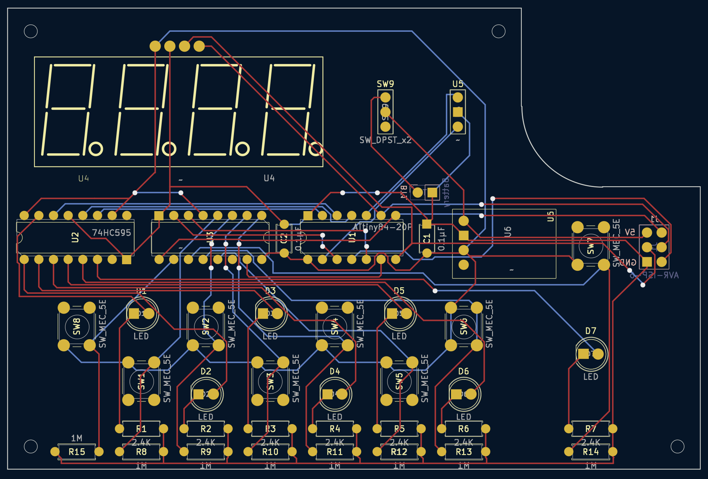

- [Source Code](#source-code)
- [3D Models](#3d-models)
- [KiCad Assets](#kicad-assets)

## Source Code

This project was developed using [PlatformIO](https://platformio.org/) with the [Arduino](https://docs.platformio.org/en/latest/frameworks/arduino.html) framework.

You can view / fork the source code here: [zbauman3/digi-roll](https://github.com/zbauman3/digi-roll).

## 3D Models

This `.step` file contains the models for the entire project, both the printable parts and 3D representations of non-printable parts (i.e. the PCB, battery, bearings, etc).

[complete-digi-roll.step](./assets/models/complete-digi-roll.step)

## KiCad Assets

- KiCad schema: [digi-roll.kicad_sch](./assets/KiCad/digi-roll.kicad_sch)
- KiCad PCB: [digi-roll.kicad_pcb](./assets/KiCad/digi-roll.kicad_pcb)
- Gerber files: [digi-roll-grb-drl.zip](./assets/KiCad/digi-roll-grb-drl.zip)

