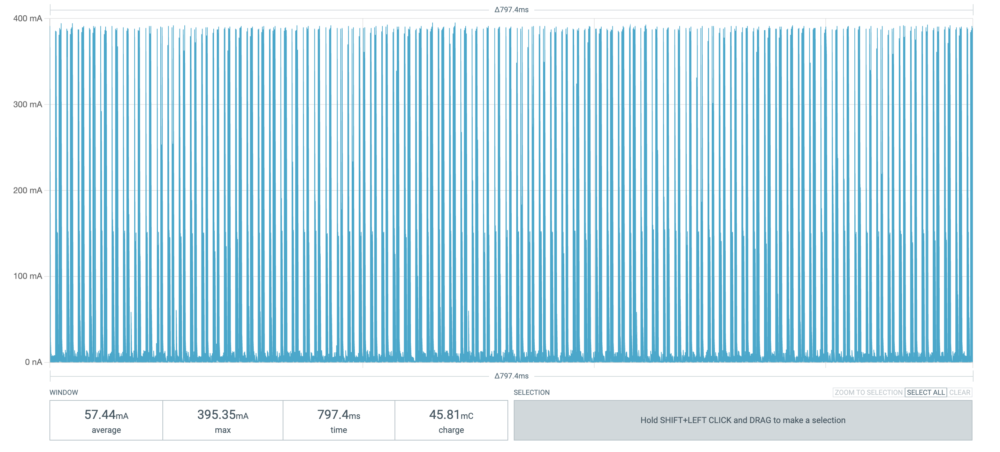
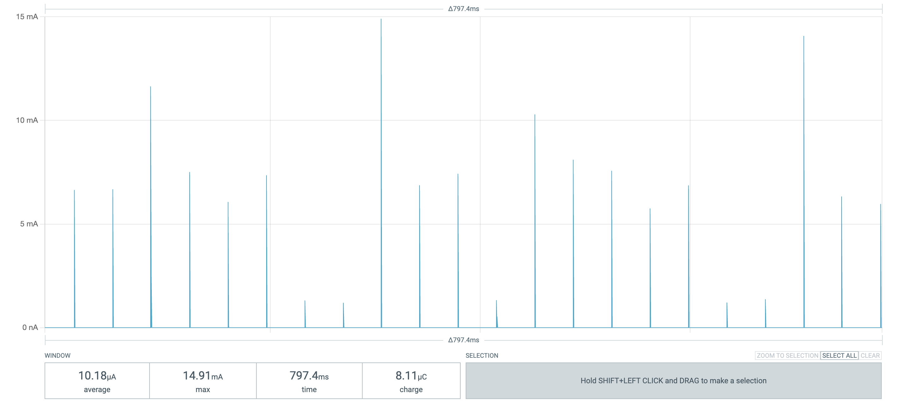

# DigiRoll

DigiRoll is a digital dice roller, specifically targeting Dungeons And Dragons.

You can view / fork the source code on GitHub: [zbauman3/digi-roll](https://github.com/zbauman3/digi-roll).

## Hardware

> [!NOTE]
> See the [Parts page](./parts) for specifics and URLs for the exact parts.

Having never designed a printed circuit board (PCB) before this project, I saw it as an excellent opportunity to learn the entire process from design to manufacturing. I used KiCad for the PCB design and JLCPCB for fabrication. Once I created the schematic in KiCad, transitioning to the PCB layout was quite manageable. By watching several YouTube tutorials, I was able to learn the necessary steps and complete the design independently.

I aimed to handle as much of the electrical engineering myself as possible while keeping the project timeline reasonable. Therefore, I made a compromise by using breakout boards for the boost converter and the 7-segment display. In future iterations, I hope to design these components myself, which could potentially reduce the cost per unit.

The main components of the board are an ATtiny84 MCU, a CD4532 8-bit encoder, and an SN74HC595 shift register. Initially, I considered using an ATtiny85, but its limited number of pins made it impractical unless I could use I2C for all peripherals, which wasn’t feasible. The shift register controls the LEDs for the buttons, while the encoder allows the device to support eight buttons using only four MCU pins (three for encoding the value and one for interrupts).

Designing the mechanism for “spinning” the dice was the next major challenge. A Hall effect sensor was an ideal choice for this purpose, but these sensors are notoriously power-hungry, conflicting with my goal of maximizing power efficiency. To address this issue, I powered the sensor through a GPIO pin on the MCU. This approach allowed me to disable the sensor when it wasn’t needed, conserving power during most of the device’s active period.

For the display, I selected an Adafruit breakout board featuring the HT16K33 driver. To expedite development, I utilized the [Adafruit_LEDBackpack](https://github.com/adafruit/Adafruit_LED_Backpack) library, which simplified the integration process. However, the library didn’t include commands to put the HT16K33 into sleep mode, which was a necessary feature given its multi-milliamp power consumption. Fortunately, I was able to manually send sleep and wake instructions to the HT16K33.

The final major component was the boost converter. Although I could have integrated this into the circuit myself, my lack of experience with such components and the desire to complete the project quickly led me to use a pre-built solution – a breakout board featuring the TPS61023. This allowed the device to be powered by just two AA batteries, even though the system required 5V. The efficiency of this setup is approximately 88%, which is acceptable but not optimal.

By combining these hardware choices with low-current LEDs and efficient software, I achieved a reasonable power profile. Using [Nordic's Power Profiler Kit II](https://www.nordicsemi.com/Products/Development-hardware/Power-Profiler-Kit-2), I analyzed the current consumption during different operating modes. At maximum current draw, the device consumes an average of approximately 60mA (see image 1 below), and in deep sleep mode, it consumes about 11µA (see image 2 below). Considering that a typical AA battery has a rough capacity of around 2,200mAh at these draw rates, this translates to approximately 70 hours of operation at maximum current draw and up to 400,000 hours (about 45 years) in sleep mode.

Active Mode:

Sleep Mode:

## Software

Coming Soon...