- [Assembled](#assembled)
- [PCB](#pcb)
- [Prototype](#prototype)
- [Schemas](#schemas)

## Assembled

<video controls="controls" class="img-full">
  <source src="./assets/media/assembled/usage-demo-2.mov">
</video>

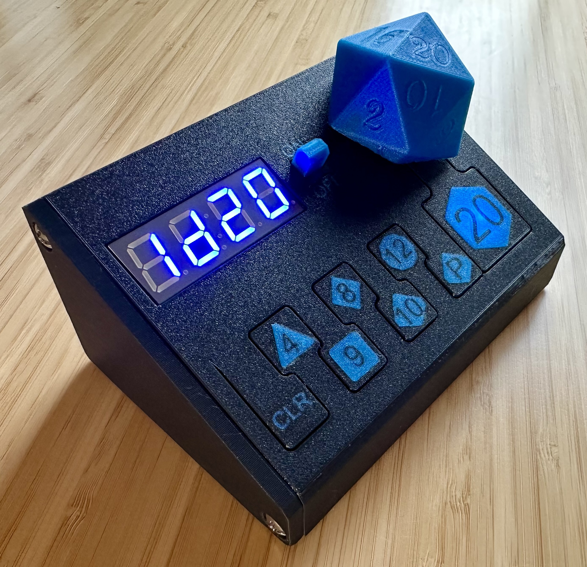

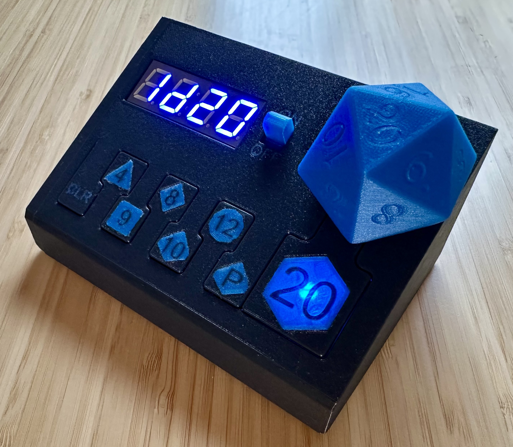

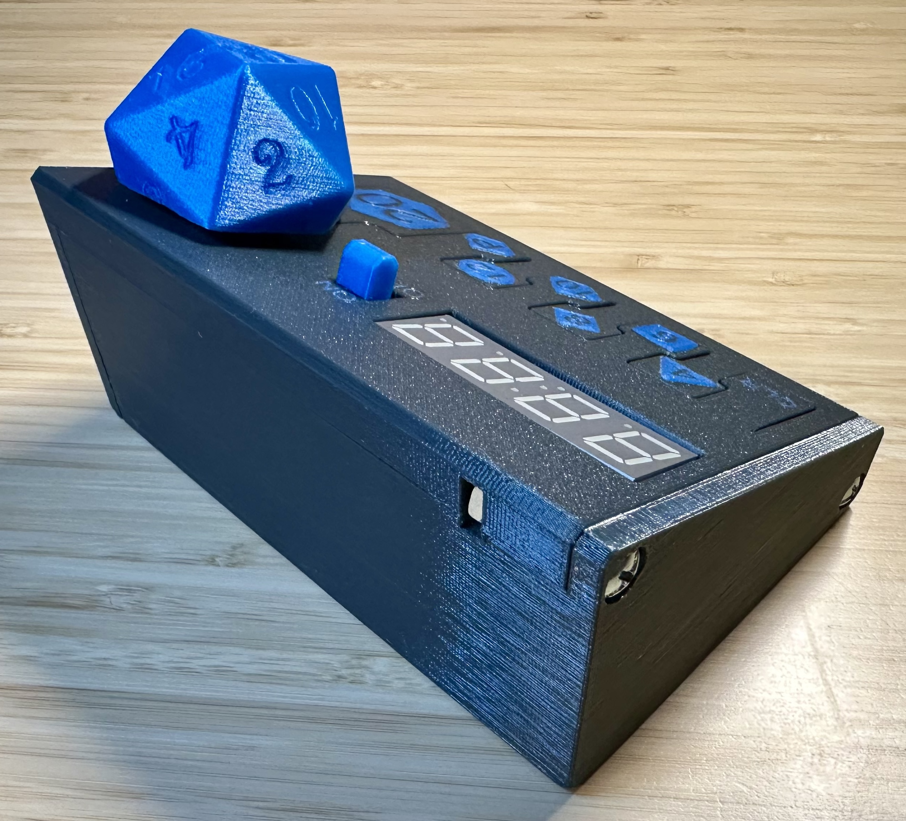

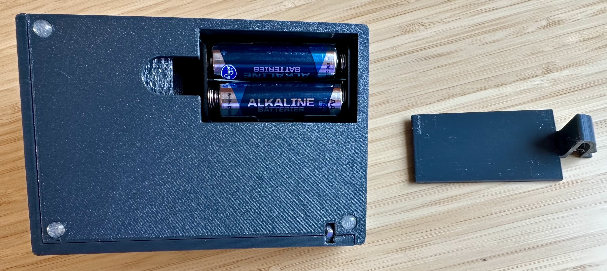

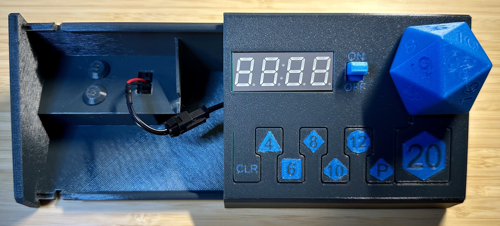

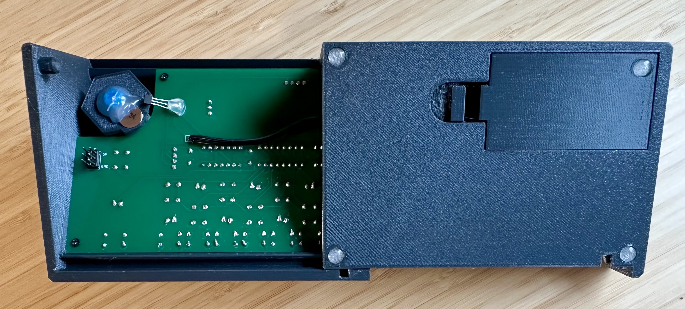

## PCB

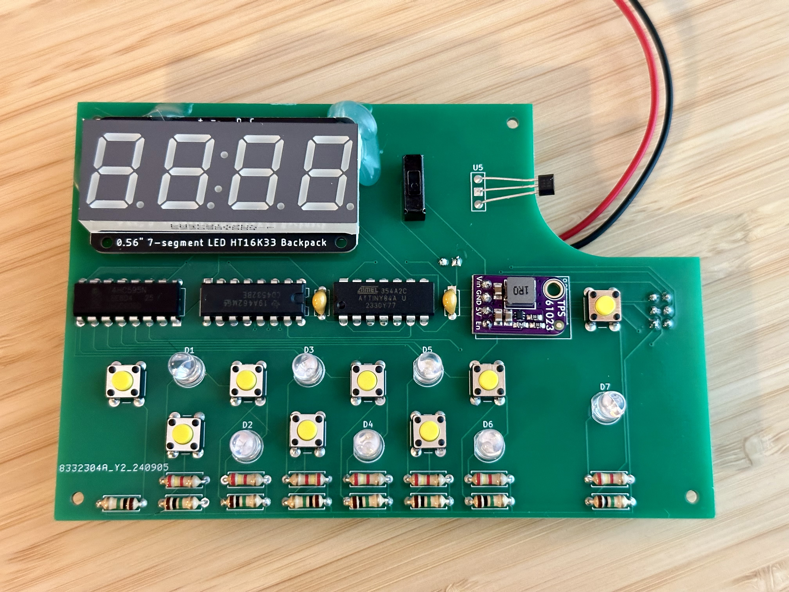

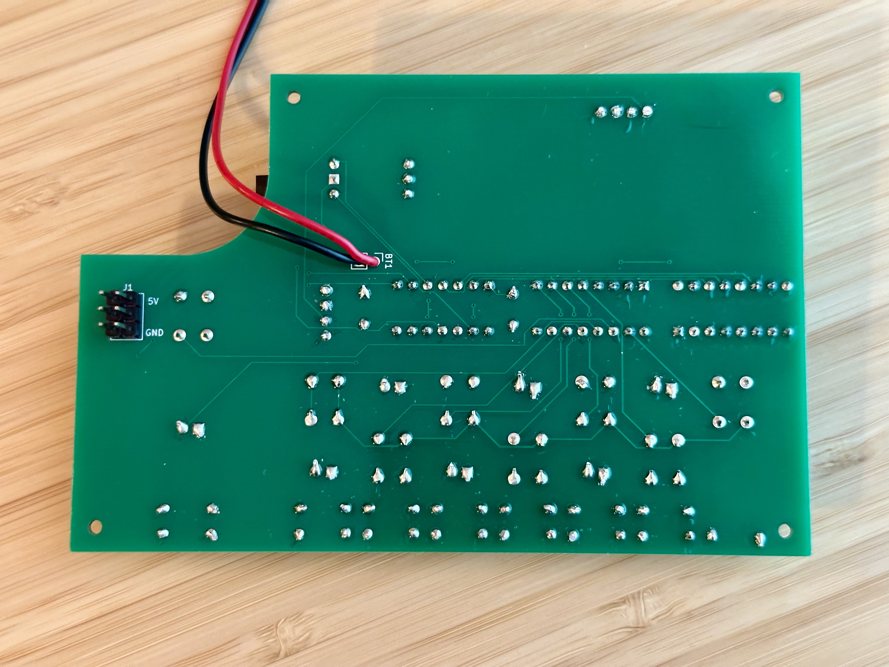

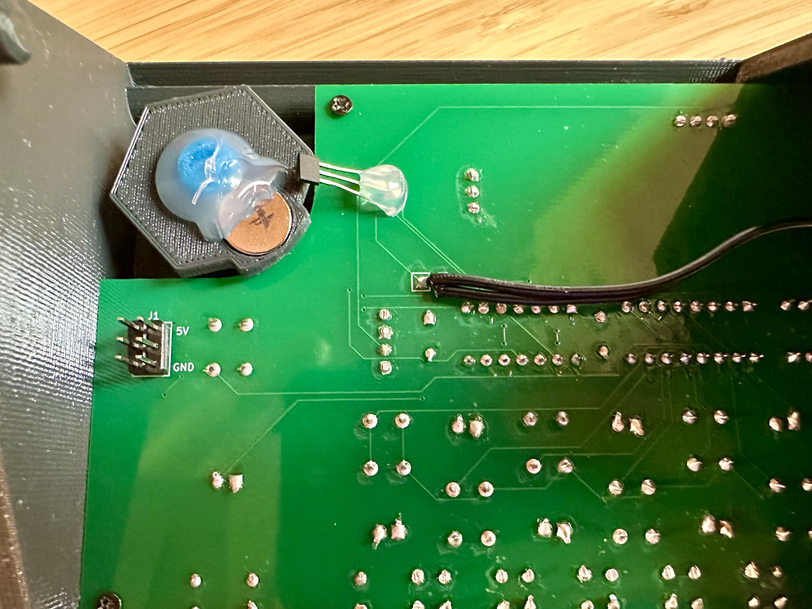

## Prototype

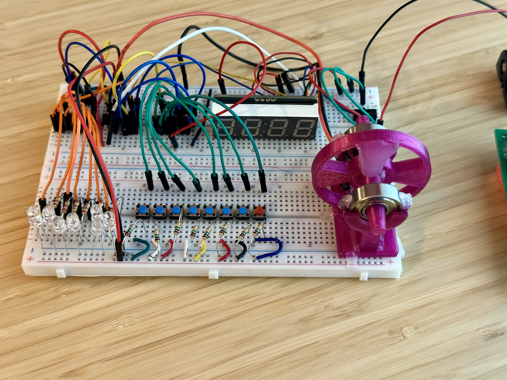

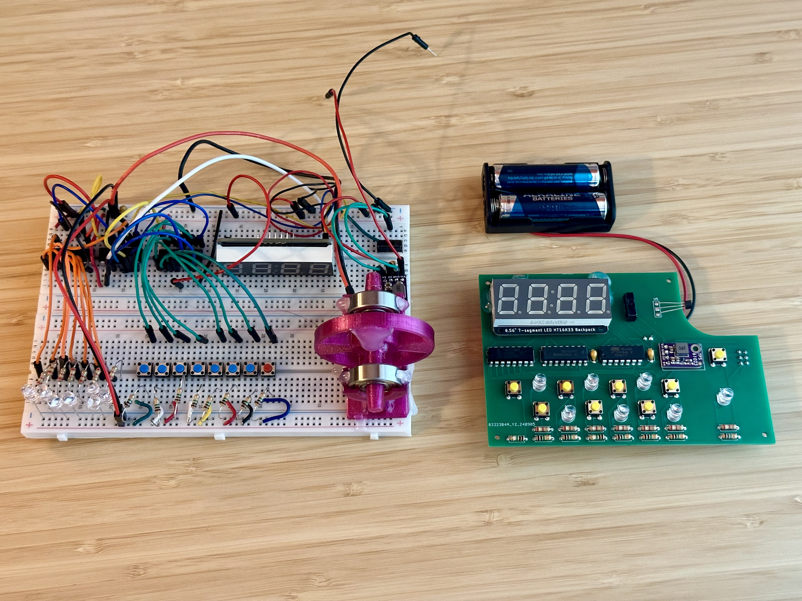

## Schemas

