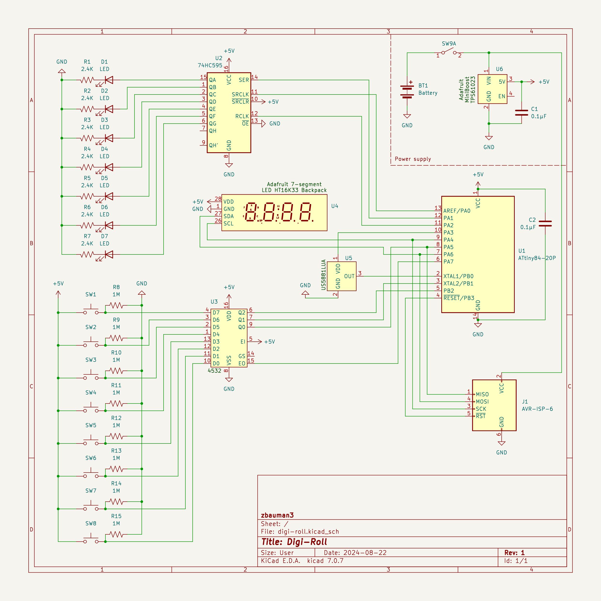
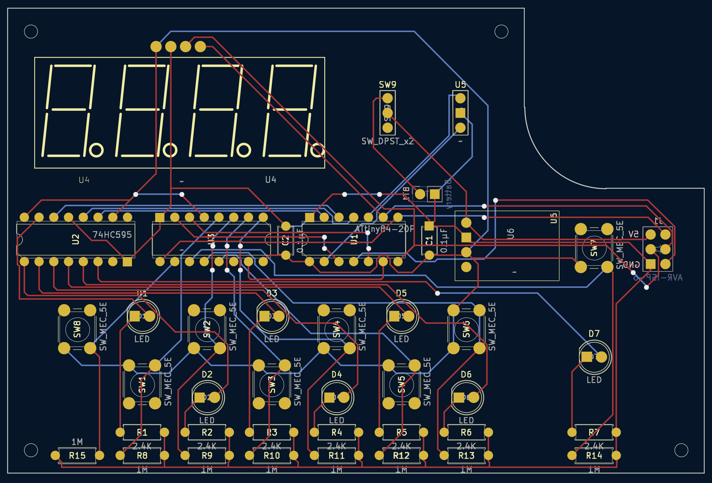

# Schematics

The schematics were built with KiCad. I've also included the exported Gerber `.zip` file that can be sent to the manufacturer directly.

- [digi-roll.kicad_sch](./assets/KiCad/digi-roll.kicad_sch)
- [digi-roll.kicad_pcb](./assets/KiCad/digi-roll.kicad_pcb)
- [digi-roll-grb-drl.zip](./assets/KiCad/digi-roll-grb-drl.zip)

